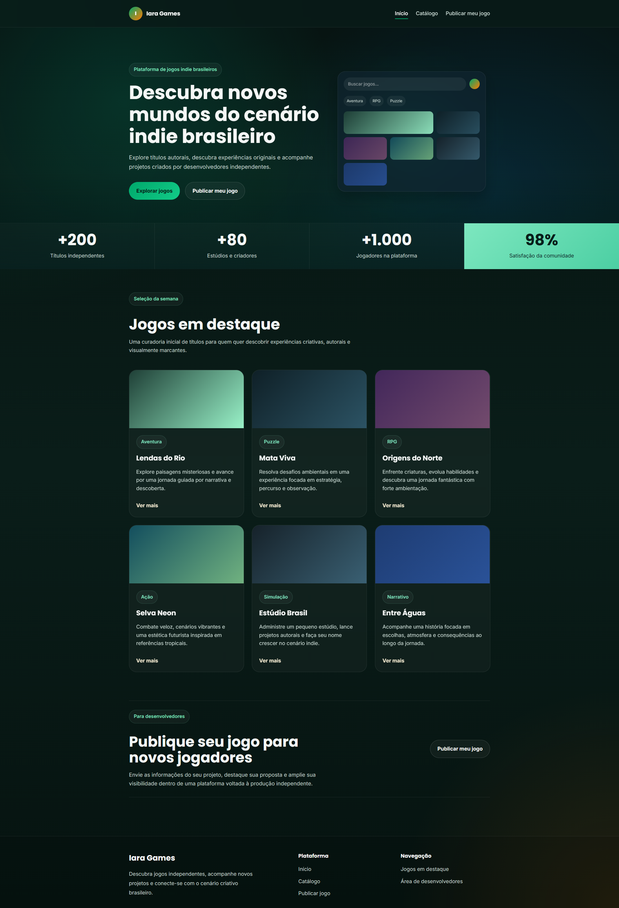

# Iara Games

## Preview

## 1. Objetivo da Sprint 02

O objetivo desta etapa foi evoluir a Iara Games a partir de uma abordagem centrada no usuário, contemplando:

* definição clara da persona;
* melhoria da estrutura de navegação;
* organização do layout com HTML semântico;
* criação de formulários funcionais (sem back-end);
* aplicação de princípios de UX e consistência visual.

---

## 2. Proposta da plataforma

A Iara Games é uma plataforma digital voltada à distribuição de jogos independentes, com foco na valorização de desenvolvedores emergentes, especialmente brasileiros.

A proposta é conectar criadores e jogadores em um ambiente digital acessível, intuitivo e visualmente organizado, facilitando tanto a descoberta de jogos quanto a publicação de novos projetos.

---

## 3. Persona

Para orientar as decisões de UX, foi definida a seguinte persona:

**Nome:** Lucas Andrade
**Idade:** 24 anos
**Profissão:** Desenvolvedor indie iniciante

**Objetivo:**
Publicar seu primeiro jogo e alcançar visibilidade.

**Dores:**

* dificuldade em divulgar seu projeto
* pouca visibilidade no mercado
* plataformas complexas ou pouco acessíveis

**Comportamento:**

* consome conteúdo digital diariamente
* acompanha jogos independentes
* busca ferramentas simples e diretas

**Insight:**
A plataforma precisa ser clara, acessível e permitir tanto explorar jogos quanto publicar projetos sem fricção.

---

## 4. Evolução da Sprint 01 para Sprint 02

Durante a Sprint 02, o projeto evoluiu de uma estrutura inicial para uma interface mais organizada e centrada no usuário.

### Principais melhorias:

* Separação da aplicação em múltiplas páginas
* Reorganização da navegação (remoção de âncoras)
* Criação de fluxo distinto para jogadores e desenvolvedores
* Implementação de formulário estruturado
* Padronização visual e de espaçamento
* Aplicação mais consistente de princípios de UX

---

## 5. Estrutura da plataforma

A navegação foi reorganizada para melhorar clareza e usabilidade.

### Páginas principais:

**Início**

* apresentação da proposta
* destaque de jogos
* CTA principal

**Catálogo**

* listagem de jogos
* navegação por categorias

**Publicar jogo**

* área para desenvolvedores
* formulário de cadastro de projeto

---

## 6. Decisões de UX

### 6.1 CTA principal

Foi definido como ação principal:

**Explorar jogos**

**Justificativa:**

* atende maior parte dos usuários (jogadores)
* reduz fricção inicial
* favorece descoberta de conteúdo

O CTA secundário:

**Publicar meu jogo**

foi mantido como ação complementar, direcionada a desenvolvedores.

---

### 6.2 Organização da navegação

Na Sprint 01, a navegação era baseada em uma única página com âncoras.

Na Sprint 02:

* a navegação foi dividida em páginas
* cada fluxo possui um contexto próprio

**Resultado:**

* maior clareza
* melhor escalabilidade
* experiência mais organizada

---

### 6.3 Hierarquia visual

Foram aplicados princípios de hierarquia para guiar o usuário:

* destaque para o hero
* títulos com maior peso visual
* CTAs visíveis e bem posicionados
* leitura escaneável

---

### 6.4 Consistência de interface

Foram padronizados:

* botões
* espaçamentos
* tipografia
* componentes (cards, formulários)

---

## 7. Estrutura do layout

A aplicação foi construída utilizando HTML semântico:

* `<header>` → navegação
* `<main>` → conteúdo principal
* `<section>` → organização das áreas
* `<footer>` → rodapé

Também foram aplicados:

* grid layout
* containers com largura controlada
* alinhamento consistente entre páginas

---

## 8. Formulário de publicação

Foi desenvolvida uma página específica para envio de jogos, contendo:

* nome do desenvolvedor
* e-mail
* nome do jogo
* estúdio/equipe
* categoria
* plataforma
* descrição do projeto
* confirmação de envio

O formulário foi organizado em grid para facilitar leitura e preenchimento.

---

## 9. Considerações de UX

Durante o desenvolvimento foram priorizados:

* clareza de navegação
* redução de complexidade
* foco nas ações principais
* consistência visual
* experiência intuitiva

A interface foi pensada para responder rapidamente:

O que é a plataforma?
O que posso fazer aqui?

---

## 10. ESG

O projeto considera aspectos de inclusão digital ao propor uma interface acessível, com navegação simples e conteúdo organizado.

Além disso, valoriza o cenário de desenvolvedores independentes brasileiros, incentivando diversidade criativa e democratização da publicação de jogos.

## 11. Repositório

https://github.com/ViniciusBritto-Design/iara-games

---
